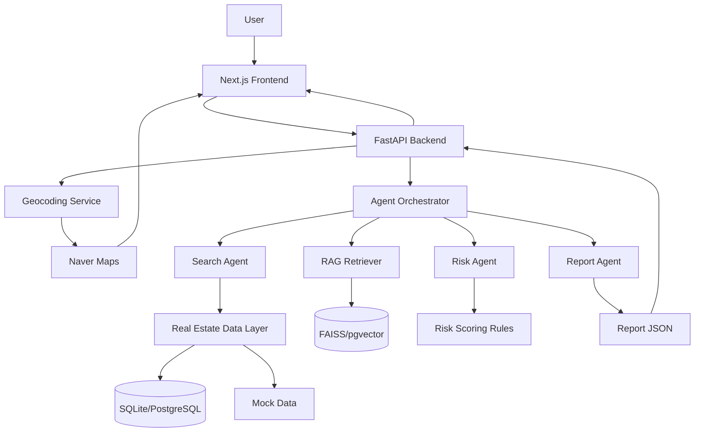

# 02. 시스템 아키텍처

## 1. 전체 구조



## 2. 개발 우선순위

### MVP에서는 반드시 구현

- Next.js 입력 화면
- FastAPI `/analyze` API
- mock data 기반 실거래가 비교
- 간단한 위험 점수 계산
- 리포트 JSON 반환
- 지도 표시용 좌표 반환

### 시간이 있으면 구현

- 실제 네이버 Geocoding API 연동
- RAG 문서 검색
- FAISS 벡터 DB
- PDF 리포트 다운로드

## 3. 추천 폴더 구조

```text
realestate-rag-copilot/
├─ README.md
├─ .env.example
├─ docker-compose.yml
│
├─ backend/
│  ├─ app/
│  │  ├─ main.py
│  │  ├─ api/
│  │  │  └─ analyze.py
│  │  ├─ core/
│  │  │  ├─ config.py
│  │  │  └─ safety.py
│  │  ├─ schemas/
│  │  │  ├─ request.py
│  │  │  └─ response.py
│  │  ├─ services/
│  │  │  ├─ geocoding_service.py
│  │  │  ├─ realestate_data_service.py
│  │  │  ├─ risk_scoring_service.py
│  │  │  ├─ rag_service.py
│  │  │  └─ report_service.py
│  │  ├─ agents/
│  │  │  ├─ orchestrator.py
│  │  │  ├─ search_agent.py
│  │  │  ├─ risk_agent.py
│  │  │  ├─ report_agent.py
│  │  │  └─ validation_agent.py
│  │  ├─ data/
│  │  │  ├─ mock_transactions.json
│  │  │  ├─ mock_poi.json
│  │  │  └─ rag_docs/
│  │  └─ tests/
│  │     ├─ test_analyze.py
│  │     └─ test_risk_scoring.py
│  ├─ requirements.txt
│  └─ run.sh
│
├─ frontend/
│  ├─ app/
│  │  ├─ page.tsx
│  │  ├─ layout.tsx
│  │  └─ globals.css
│  ├─ components/
│  │  ├─ AnalysisForm.tsx
│  │  ├─ RiskReport.tsx
│  │  ├─ MapView.tsx
│  │  └─ EvidenceList.tsx
│  ├─ lib/
│  │  ├─ api.ts
│  │  └─ types.ts
│  ├─ package.json
│  └─ next.config.js
│
└─ docs/
   ├─ PRD.md
   ├─ API_SPEC.md
   └─ DEMO_SCENARIO.md
```

## 4. Backend API 설계

### POST `/analyze`

#### Request

```json
{
  "contract_type": "jeonse",
  "address": "서울시 마포구 성산동 000-00",
  "deposit": 300000000,
  "monthly_rent": 0,
  "sale_price": null,
  "property_type": "villa",
  "user_question": "이 집 전세 계약해도 괜찮을까?"
}
```

#### Response

```json
{
  "risk_level": "주의",
  "risk_score": 68,
  "summary": "현재 입력 조건 기준으로 일부 위험 신호가 있어 추가 확인이 필요합니다.",
  "location": {
    "lat": 37.5665,
    "lng": 126.9780
  },
  "evidence": [
    {
      "title": "주변 전세가 비교",
      "description": "입력 보증금이 주변 유사 거래 평균보다 높습니다.",
      "source": "mock_transactions"
    }
  ],
  "market_comparison": {
    "nearby_avg_deposit": 260000000,
    "input_deposit": 300000000,
    "difference_rate": 15.3
  },
  "next_actions": [
    "등기부등본 확인",
    "건축물대장 확인",
    "보증보험 가입 가능 여부 확인",
    "특약 문구 검토"
  ],
  "warnings": [
    "본 결과는 공개 데이터와 입력값 기반의 참고용 분석입니다. 최종 계약 전 전문가 검토가 필요합니다."
  ]
}
```

## 5. Risk Scoring 기본 룰

초기 버전에서는 ML 모델보다 규칙 기반 점수로 구현한다.

| 조건 | 점수 |
|---|---:|
| 입력 보증금이 주변 평균보다 10% 이상 높음 | +20 |
| 입력 보증금이 주변 평균보다 20% 이상 높음 | +35 |
| 최근 거래량 감소 | +15 |
| 건축물 정보 미확인 | +10 |
| 등기부등본 미업로드 | +20 |
| 보증보험 가능 여부 미확인 | +15 |

### 위험도 구간

| 점수 | 위험도 |
|---:|---|
| 0~30 | 낮음 |
| 31~60 | 주의 |
| 61~80 | 검토 필요 |
| 81~100 | 위험 |

## 6. 프론트엔드 화면 구성

### 메인 화면

- 서비스명: 집판단
- 한 줄 설명: 계약 전, AI가 먼저 위험 신호를 확인합니다.
- 입력 폼
- 분석 버튼

### 결과 화면

- 종합 위험도 카드
- 지도 영역
- 핵심 근거 카드
- 주변 시세 비교표
- 다음 액션 체크리스트
- 주의 문구

## 7. 데모 우선 전략

API 연동이 늦어질 경우에도 반드시 발표 가능한 구조를 유지한다.

1. mock geocoding 사용
2. mock transactions 사용
3. mock region statistics 사용
4. RAG 문서는 로컬 markdown 기반 사용
5. 실제 API는 `.env` 값이 있을 때만 호출
