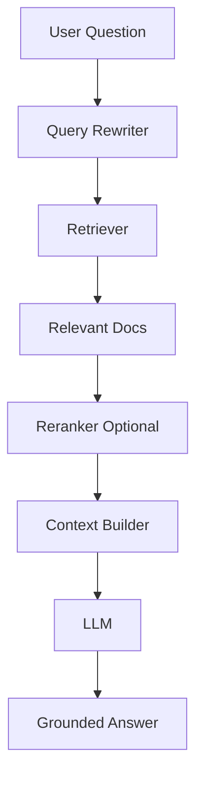
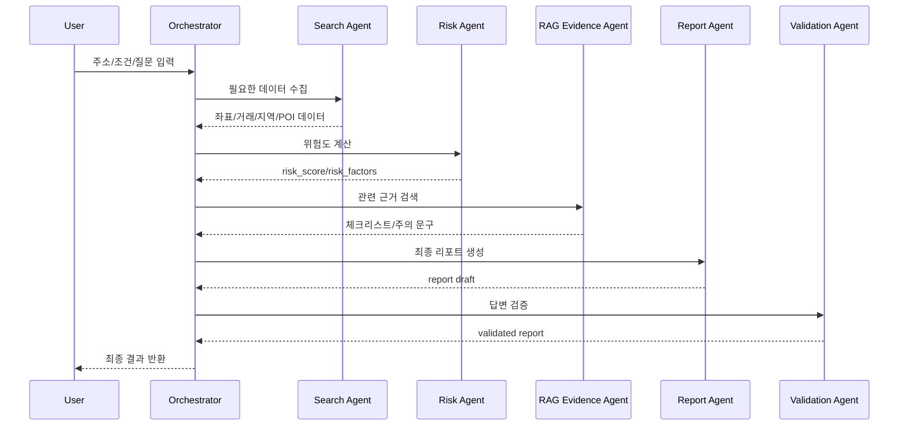

# 04. RAG 및 Agent 설계

## 1. 핵심 방향

이 프로젝트에서 RAG는 단순 문서 검색 기능이 아니다.

> RAG는 부동산 판단 근거를 찾아 조립하는 엔진이고, Agent는 그 근거를 활용해 사용자의 의사결정 흐름을 진행하는 실행자이다.

## 2. RAG 역할

RAG는 다음 문서를 검색한다.

- 전세 계약 전 체크리스트
- 등기부등본 확인 항목
- 건축물대장 확인 항목
- 보증금 위험 판단 기준
- 부동산 리포트 작성 가이드
- 주의 문구 및 안전 표현 가이드

## 3. RAG 파이프라인



## 4. MVP RAG 구현 방식

### 1차 구현

- 로컬 markdown 문서 사용
- chunk 단위 분할
- FAISS 또는 단순 keyword search
- 결과 3~5개를 LLM context로 전달

### 2차 구현

- embedding 기반 semantic search
- BM25 + vector hybrid search
- reranker 추가
- 출처 표시

## 5. Agent 구성

### 5-1. Intent Classifier

사용자 질문을 분류한다.

| Intent | 예시 |
|---|---|
| risk_check | “이 집 계약해도 돼?” |
| price_compare | “보증금이 비싼 편이야?” |
| region_analysis | “이 지역 괜찮아?” |
| action_request | “뭘 더 확인해야 해?” |
| report_request | “리포트로 정리해줘” |

### 5-2. Search Agent

필요한 데이터를 수집한다.

입력:

- 주소
- 계약 유형
- 보증금/매매가
- 주택 유형

출력:

- 좌표
- 주변 거래 데이터
- 지역 통계
- 주변 POI
- 데이터 누락 항목

### 5-3. Risk Agent

위험 신호를 계산한다.

검토 항목:

- 주변 평균 대비 보증금 차이
- 전세가율 추정 가능 여부
- 거래량 감소 여부
- 건축물 정보 확인 여부
- 등기부등본 확인 여부
- 보증보험 확인 여부

출력:

- risk_score
- risk_level
- risk_factors
- missing_checks

### 5-4. RAG Evidence Agent

계약 전 확인사항과 위험 판단 기준 문서를 검색한다.

출력:

- evidence snippets
- source titles
- recommended wording

### 5-5. Report Agent

최종 리포트를 생성한다.

출력 구조:

```json
{
  "risk_level": "주의",
  "summary": "현재 데이터 기준으로 추가 확인이 필요합니다.",
  "key_findings": [],
  "market_comparison": {},
  "map_insights": [],
  "next_actions": [],
  "warnings": []
}
```

### 5-6. Validation Agent

AI 답변이 과도하게 단정적인지 검증한다.

검증 항목:

- 계약 가능/불가능 단정 여부
- 출처 없는 주장 여부
- 미확인 데이터를 확인된 사실처럼 말했는지
- 고위험 항목 누락 여부
- 주의 문구 포함 여부

## 6. Orchestrator 흐름



## 7. LLM 프롬프트 원칙

### System Prompt 예시

```text
당신은 부동산 계약 전 리스크를 분석하는 AI 보조자입니다.
당신은 사용자가 입력한 데이터와 제공된 근거만 사용해 답변해야 합니다.
계약 가능 여부를 단정하지 말고, 확인된 사실과 추정, 추가 확인 필요 항목을 분리해서 말하세요.
고위험 항목은 반드시 전문가 검토를 권장하세요.
```

### Report Prompt 예시

```text
다음 입력 데이터, 위험 점수, RAG 근거를 바탕으로 부동산 계약 전 리스크 리포트를 작성하세요.

반드시 포함할 항목:
1. 종합 위험도
2. 핵심 근거 3개 이상
3. 확인된 사실
4. 추정 또는 미확인 항목
5. 다음 액션 체크리스트
6. 주의 문구

금지:
- 계약해도 된다고 단정하지 말 것
- 사기라고 단정하지 말 것
- 출처 없는 판단을 하지 말 것
```

## 8. 최소 구현 코드 방향

Codex는 다음 순서로 구현한다.

1. `schemas/request.py`, `schemas/response.py` 생성
2. `services/realestate_data_service.py`에서 mock 거래 데이터 로드
3. `services/geocoding_service.py`에서 mock 좌표 반환
4. `services/risk_scoring_service.py`에서 위험도 계산
5. `services/rag_service.py`에서 로컬 문서 검색
6. `agents/orchestrator.py`에서 전체 흐름 연결
7. `/analyze` API에서 orchestrator 호출
8. frontend에서 결과 출력
