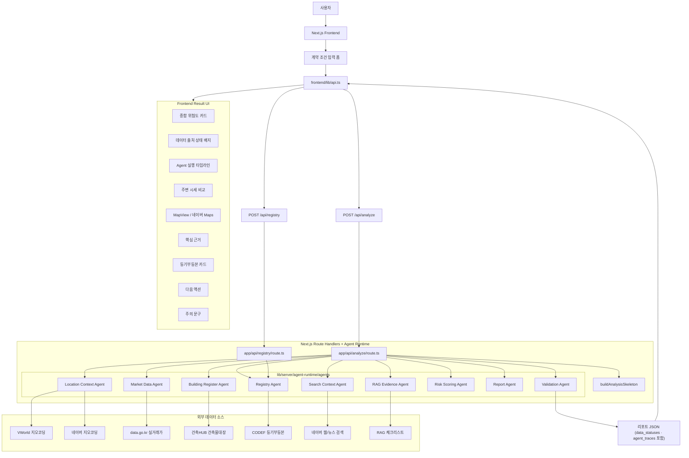
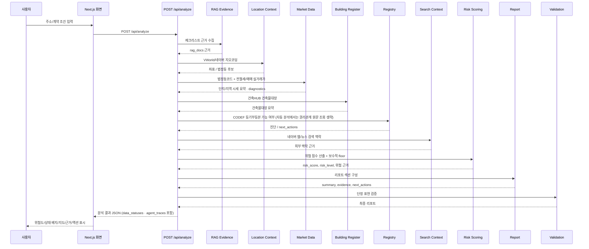

# 트러스트 아크(Trust Ark) 설계 구조 다이어그램

## 시스템 아키텍처

```mermaid
flowchart TD
    U["사용자"] --> FE["Next.js Frontend"]

    FE --> FORM["계약 조건 입력 폼"]
    FORM --> API_CLIENT["frontend/lib/api.ts"]
    API_CLIENT --> ANALYZE["POST /api/analyze"]
    API_CLIENT --> REGISTRY_API["POST /api/registry"]

    subgraph RUNTIME["Next.js Route Handlers + Agent Runtime"]
        ANALYZE_ROUTE["app/api/analyze/route.ts"]
        REGISTRY_ROUTE["app/api/registry/route.ts"]
        SKELETON["buildAnalysisSkeleton"]

        ANALYZE_ROUTE --> SKELETON

        subgraph AGENTS["lib/server/agent-runtime/agents"]
            RAG["RAG Evidence Agent"]
            LOC["Location Context Agent"]
            MARKET["Market Data Agent"]
            BLDG["Building Register Agent"]
            REG["Registry Agent"]
            SEARCH["Search Context Agent"]
            RISK["Risk Scoring Agent"]
            REPORT["Report Agent"]
            VALID["Validation Agent"]
        end

        ANALYZE_ROUTE --> RAG
        ANALYZE_ROUTE --> LOC
        ANALYZE_ROUTE --> MARKET
        ANALYZE_ROUTE --> BLDG
        ANALYZE_ROUTE --> REG
        ANALYZE_ROUTE --> SEARCH
        ANALYZE_ROUTE --> RISK
        ANALYZE_ROUTE --> REPORT
        ANALYZE_ROUTE --> VALID

        REGISTRY_ROUTE --> REG
    end

    subgraph EXT["외부 데이터 소스"]
        VWORLD["VWorld 지오코딩"]
        NAVER_GEO["네이버 지오코딩"]
        DATA_GO_KR["data.go.kr 실거래가"]
        BUILDING_HUB["건축HUB 건축물대장"]
        CODEF["CODEF 등기부등본"]
        NAVER_SEARCH["네이버 웹/뉴스 검색"]
        RAG_DOCS["RAG 체크리스트"]
    end

    LOC --> VWORLD
    LOC --> NAVER_GEO
    MARKET --> DATA_GO_KR
    BLDG --> BUILDING_HUB
    REG --> CODEF
    SEARCH --> NAVER_SEARCH
    RAG --> RAG_DOCS

    ANALYZE --> ANALYZE_ROUTE
    REGISTRY_API --> REGISTRY_ROUTE

    VALID --> JSON["리포트 JSON (data_statuses · agent_traces 포함)"]
    JSON --> API_CLIENT

    subgraph UI["Frontend Result UI"]
        RISK_CARD["종합 위험도 카드"]
        STATUS_BADGES["데이터 출처 상태 배지"]
        TRACE["Agent 실행 타임라인"]
        MARKET_CARD["주변 시세 비교"]
        MAP["MapView / 네이버 Maps"]
        EVIDENCE_LIST["핵심 근거"]
        REGISTRY_CARD["등기부등본 카드"]
        ACTIONS["다음 액션"]
        WARNINGS["주의 문구"]
    end

    API_CLIENT --> UI
```

## 분석 시퀀스

```mermaid
sequenceDiagram
    participant User as 사용자
    participant FE as Next.js 화면
    participant API as POST /api/analyze
    participant RAG as RAG Evidence
    participant LOC as Location Context
    participant MKT as Market Data
    participant BLD as Building Register
    participant REG as Registry
    participant SRC as Search Context
    participant RISK as Risk Scoring
    participant RP as Report
    participant VA as Validation

    User->>FE: 주소/계약 조건 입력
    FE->>API: POST /api/analyze
    API->>RAG: 체크리스트 근거 수집
    RAG-->>API: rag_docs 근거

    API->>LOC: VWorld/네이버 지오코딩
    LOC-->>API: 좌표 / 법정동 후보

    API->>MKT: 법정동코드 + 전월세/매매 실거래가
    MKT-->>API: 단지/지역 시세 요약 · diagnostics

    API->>BLD: 건축HUB 건축물대장
    BLD-->>API: 건축물대장 요약

    API->>REG: CODEF 등기부등본 가능 여부 (자동 분석에서는 권리관계 원문 조회 생략)
    REG-->>API: 진단 / next_actions

    API->>SRC: 네이버 웹/뉴스 검색 맥락
    SRC-->>API: 외부 맥락 근거

    API->>RISK: 위험 점수 산출 + 보수적 floor
    RISK-->>API: risk_score, risk_level, 위험 근거

    API->>RP: 리포트 섹션 구성
    RP-->>API: summary, evidence, next_actions

    API->>VA: 단정 표현 검증
    VA-->>API: 최종 리포트

    API-->>FE: 분석 결과 JSON (data_statuses · agent_traces 포함)
    FE-->>User: 위험도/상태 배지/지도/근거/액션 표시
```
